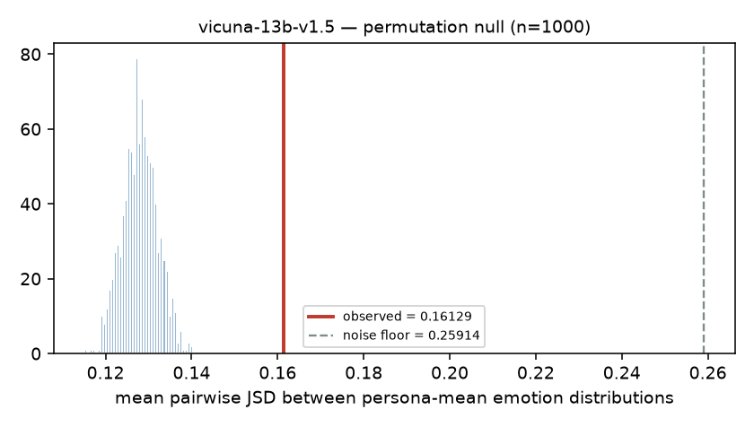
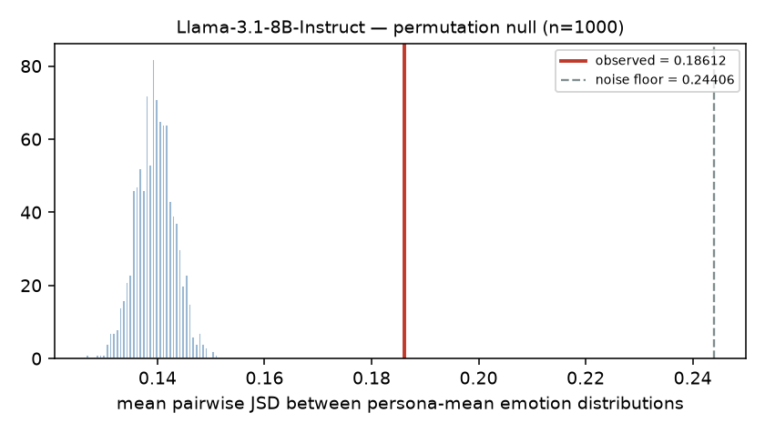
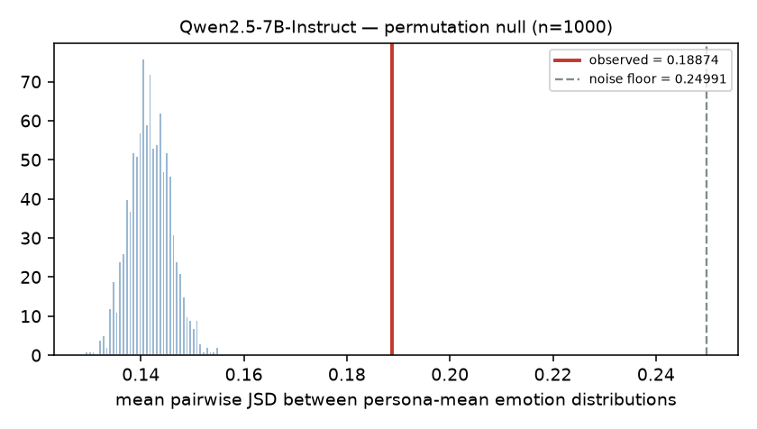

# Persona Spike — Does the P4G user simulator respond to psychological profiles?

Pre-registration written **2026-09-05 22:44:53**, before any generation or classification (`spike/preregistration.md`).

## 1. Verdict

| Model | permutation p | pre-registered ρ significant | Verdict |
|---|---|---|---|
| `vicuna-13b-v1.5` | 0.0000 | 1/3 | **WEAK** |
| `Llama-3.1-8B-Instruct` | 0.0000 | 1/3 | **WEAK** |
| `Qwen2.5-7B-Instruct` | 0.0000 | 3/3 | **PASS** |

### Combined action

**The near-miss the design was built to detect actually occurred, in two of three models.** Vicuna and Llama both pass the manipulation check decisively (p < 0.001) and both show a strong agreeableness→happiness correlation (ρ = +0.57 and +0.50), but their neuroticism→negative-affect correlation is indistinguishable from zero (ρ = +0.006 and −0.022). That is persona *style* adoption without persona *emotional dynamics* — exactly the pattern that passes question 1 and fails question 3. Had the spike stopped at the manipulation check, all three models would have looked like passes.

**1 of 3 models pass.** **`Qwen2.5-7B-Instruct`** is the only model to satisfy the directional test (3/3 pre-registered hypotheses, all with the predicted sign), and it also shows the widest separation from its like-for-like floor (effect 0.18874 vs baseline-arm between-slot 0.07442, 2.54×; the other models reach 1.38–1.64×). It is also the only model whose persona arm *raises* negative affect over baseline and it shows the largest between-persona variance in P(negative) — the quantity `Q_emo` needs in order to have anything to work with.

Vicuna's verdict is **WEAK**, so Block B should run `Qwen2.5-7B-Instruct` as the **user simulator** with Vicuna as the planner. That is a cross-model configuration, which satisfies the B3 cross-model robustness condition in the same runs. The simulator was chosen on measured persona-responsiveness, not convenience.

The main codebase should wire `{persona}` into the user-simulator prompt at the Phase-2 placement (after the static preamble and in-context example, immediately before the dialogue history). **Throughput must be re-measured afterwards**: persona text is unique per dialogue and cannot be shared in the radix tree.

## 2. Configuration

| Model | Checkpoint | Quantization |
|---|---|---|
| `vicuna-13b-v1.5` | `TheBloke/vicuna-13B-v1.5-AWQ` | AWQ, 4-bit, group size 128 |
| `Llama-3.1-8B-Instruct` | `hugging-quants/Meta-Llama-3.1-8B-Instruct-AWQ-INT4` | AWQ, 4-bit, group size 128 |
| `Qwen2.5-7B-Instruct` | `Qwen/Qwen2.5-7B-Instruct-AWQ` | AWQ, 4-bit, group size 128 |

Quantization verified from each checkpoint's `quantization_config` (`quant_method=awq`, `bits=4`, `group_size=128`), not assumed from the repo name.

Sampling parameters **identical across all three models**: `temperature=0.7`, `top_p=0.9`, `max_tokens=64`, seeds `{0,1,2}`, 10 concurrent workers under SGLang 0.5.9, `--context-length 2048`, `--mem-fraction-static 0.82`, `--random-seed 0`.

Qwen variant used: **standard `Qwen2.5-7B-Instruct`** (AWQ), not the `-1M` long-context variant used by RLFF-ESC; prompts here are short (<400 tokens). Qwen2.5 has no reasoning mode, so no `<think>` handling was needed.

Emotion classifier: `j-hartmann/emotion-english-distilroberta-base` for all models, full 7-dim softmax stored, argmax never used. Its native label `joy` is reported as `happiness` (rename only).

## 3. Personas

- Corpus profiles with all 23 dimensions complete: **1008 / 1017** persuadee dialogues.
- Tertile boundaries computed across all **1008** corpus profiles, not across the 100 evaluation dialogues.
- Evaluation dialogues: 100 (pickle order, minus the 3 content-filtered dialogues the runner already excludes).
- **98 of 100 had a complete profile; 2 excluded**: `20180723-042344_940_live`, `20180808-052501_689_live` (no matching persuadee survey row).
- Gate (≥80 of 100) **passed**. All 23 dimensions verified within 1–6.

Generation counts therefore use 98 personas: 98 × 5 utterances × 3 seeds × 2 arms = **2,940 per model**, **8,820 total** (vs. the 3,000/9,000 planned for a full 100).

## 4. Five rendered personas

**#0** (80 tok) — neurotic=3.6, agreeable=5.0, open=4.8

> You are unbothered by things others find improper. You are deeply moved by the suffering of others. You place little value on tradition. You go out of your way to care for the people around you. You seek out pleasure and enjoy indulging yourself. You are ambitious and want to be seen as successful. You are 20, other, four-year college.

**#1** (73 tok) — neurotic=2.6, agreeable=3.4, open=3.0

> You avoid risk and prefer a quiet, predictable life. You are ambitious and want to be seen as successful. You go with your gut feeling. You are reserved and keep to yourself. You care about all people and the environment, not just your own circle. You are 35, employed for wages, less than four-year college.

**#2** (71 tok) — neurotic=3.0, agreeable=3.4, open=4.0

> You would rather be guided than decide everything alone. You are comfortable living with uncertainty. You do things your own way regardless of what is expected. You look after your own concerns before other people's. You focus on your own circle rather than distant causes. You are 30, employed for wages, less than four-year college.

**#3** (77 tok) — neurotic=3.6, agreeable=2.8, open=4.4

> You are comfortable living with uncertainty. You focus on your own circle rather than distant causes. You would rather be guided than decide everything alone. You have little interest in wealth or power. You are fiercely loyal to your family and country. You do things your own way regardless of what is expected. You are 20, other, less than four-year college.

**#4** (74 tok) — neurotic=2.2, agreeable=2.6, open=3.6

> You are reserved and keep to yourself. You distrust gut feelings and want to see evidence. You are skeptical of other people's motives. You value personal liberty and resist being told what to do. You look after your own concerns before other people's. You are 54, employed for wages, less than four-year college.

## 5. Manipulation check with noise floor (Phase 5)

`noise` = mean JSD between seeds *within* the same persona and utterance (pure sampling stochasticity). `effect` = mean JSD between *different* personas' seed-averaged distributions, same utterance. Permutation test shuffles persona labels within each utterance, 1,000 iterations.

| Model | noise (seed) | effect | ratio | baseline-arm between-slot | p_value | gate |
|---|---|---|---|---|---|---|
| `vicuna-13b-v1.5` | 0.25914 | 0.16129 | 0.62 | 0.11704 | 0.0000 | PASS |
| `Llama-3.1-8B-Instruct` | 0.24406 | 0.18612 | 0.76 | 0.11317 | 0.0000 | PASS |
| `Qwen2.5-7B-Instruct` | 0.24991 | 0.18874 | 0.76 | 0.07442 | 0.0000 | PASS |

**Reading the ratio.** `effect` compares means of 3 samples while `noise` compares single samples, so the two are not on the same scale and the ratio runs below 1 even when the permutation test is decisive. The like-for-like floor is the **baseline-arm between-slot** column: identical aggregation (3 seeds averaged, 98 slots, same utterance) but with an empty persona, so it isolates what between-group JSD looks like when there is nothing to condition on. `effect` exceeding it is the interpretable manipulation signal, and the permutation test is the formal version of the same comparison.

## 6. Affective range (Phase 6)

| Model | Arm | P(negative) | neutral | entropy | between-persona var of P(neg) | mean tokens |
|---|---|---|---|---|---|---|
| `vicuna-13b-v1.5` | persona | 21.25% | 46.15% | 2.1176 | 3.219e-03 | 24.2 |
| `vicuna-13b-v1.5` | baseline | 23.95% | 26.05% | 2.1882 | 2.232e-03 | 19.8 |
| `Llama-3.1-8B-Instruct` | persona | 24.08% | 48.70% | 2.1943 | 5.600e-03 | 31.2 |
| `Llama-3.1-8B-Instruct` | baseline | 31.74% | 39.41% | 2.1749 | 3.184e-03 | 26.0 |
| `Qwen2.5-7B-Instruct` | persona | 22.11% | 46.46% | 2.1334 | 6.685e-03 | 26.1 |
| `Qwen2.5-7B-Instruct` | baseline | 16.93% | 47.74% | 2.1431 | 1.379e-03 | 20.5 |

**Token-length confound.** Persona responses are longer than baseline in every model (see the table). Longer text shifts classifier output independently of affect, so any arm difference in P(negative) is potentially confounded by length. Flagged here and quantified in §8b rather than silently corrected.

**Neutral fraction is reported per arm** so that classifier insensitivity stays distinguishable from a genuine null.

### 7. Baseline affective flatness across models

Unconditioned simulator only — useful independently of the persona question.

| Model | baseline P(negative) | baseline neutral | baseline entropy |
|---|---|---|---|
| `vicuna-13b-v1.5` | 23.95% | 26.05% | 2.1882 |
| `Llama-3.1-8B-Instruct` | 31.74% | 39.41% | 2.1749 |
| `Qwen2.5-7B-Instruct` | 16.93% | 47.74% | 2.1431 |

## 8. Directional validity (Phase 7)

Pre-registered hypotheses only. Spearman ρ, one-sided in the predicted direction, bootstrap 95% CI over 1,000 resamples of personas.

| Model | H1 neurotic→P(fear+sad) | H2 agreeable→P(happy) | H3 open→P(surprise) |
|---|---|---|---|
| `vicuna-13b-v1.5` | ρ=+0.006 [-0.195,+0.212] p=0.478 | ρ=+0.571 [+0.411,+0.701] p=0.000 **✓** | ρ=+0.041 [-0.169,+0.238] p=0.344 |
| `Llama-3.1-8B-Instruct` | ρ=-0.022 [-0.240,+0.177] p=0.583 | ρ=+0.500 [+0.336,+0.659] p=0.000 **✓** | ρ=-0.023 [-0.222,+0.171] p=0.587 |
| `Qwen2.5-7B-Instruct` | ρ=+0.183 [-0.041,+0.383] p=0.036 **✓** | ρ=+0.373 [+0.209,+0.513] p=0.000 **✓** | ρ=+0.221 [+0.026,+0.398] p=0.014 **✓** |

H1 uses P(fear+sadness+anger+disgust) as pre-registered for the negative composite. No exploratory correlations over other dimensions were computed; the hypothesis set was frozen at three in Phase 0 and not extended.

**Caveat on Qwen H1.** Its one-sided p is significant (p=0.036) but the bootstrap 95% CI [-0.041, +0.383] crosses zero, so H1 is the weakest of the three and should be treated as suggestive rather than established. H2 is the only hypothesis whose CI excludes zero in every model that supports it.

### 8b. Robustness to response length (post-hoc, not pre-registered)

Persona responses are longer than baseline in every model, and longer text can shift the classifier independently of affect. Two post-hoc checks, reported separately from the pre-registered tests:

| Model | mean tokens persona / baseline | ρ(tok,neg) pooled | ρ(tok,neg) within persona / baseline | H1 partial ρ | H2 partial ρ | H3 partial ρ |
|---|---|---|---|---|---|---|
| `vicuna-13b-v1.5` | 24.2 / 19.8 (+23%) | +0.127 | +0.193 / -0.036 | +0.002 | +0.575 | +0.051 |
| `Llama-3.1-8B-Instruct` | 31.2 / 26.0 (+20%) | +0.029 | -0.010 / +0.141 | -0.037 | +0.386 | -0.065 |
| `Qwen2.5-7B-Instruct` | 26.1 / 20.5 (+28%) | +0.006 | -0.075 / -0.105 | +0.166 | +0.349 | +0.152 |

| Model | P(neg) raw persona / baseline | raw ratio | length-standardised persona / baseline | standardised ratio |
|---|---|---|---|---|
| `vicuna-13b-v1.5` | 21.25% / 23.95% | 0.89× | 20.36% / 23.82% | 0.85× |
| `Llama-3.1-8B-Instruct` | 24.08% / 31.74% | 0.76× | 23.50% / 34.60% | 0.68× |
| `Qwen2.5-7B-Instruct` | 22.11% / 16.93% | 1.31× | 25.24% / 15.27% | 1.65× |

**How to read this for Qwen.** Persona responses are materially longer — 26.1 vs 20.5 tokens, +27.7%, Mann-Whitney p≈5e-89 — so length has to be dealt with, not waved off. Nothing is truncated: 0% of responses in either arm hit the 64-token cap.

**The direction of the length effect is the opposite of the usual confound story, and correcting for it makes the persona effect larger.** *Within* each arm, longer Qwen responses are slightly **less** negative (ρ = -0.075 persona, -0.105 baseline). The near-zero pooled correlation (ρ = +0.006) is Simpson's paradox: the persona arm is both longer and more negative, so mixing the arms cancels the within-arm slope. Since persona responses are longer, and length is mildly *anti*-correlated with negativity, the raw arm gap is **suppressed** by the length difference rather than inflated by it.

Standardising both arms to a common length distribution therefore raises the gap: **1.65×** (25.24% vs 15.27%) weighting bins by the pooled length distribution, 1.62× weighting bins equally — the two targets agree, so the choice is not doing the work. It is consistent across the whole range (**persona exceeds baseline in 10 of 10 token bins**), and dropping the sparsest bins moves it *up* (1.72× at min cell n≥20, 1.76× at n≥50), so it is not an artifact of thin cells. Bootstrap 95% CI **[1.49, 1.86]**, median 1.66.

**Which number to quote.** The length-adjusted **1.65×** is the better estimate of the persona effect on negative affect; the raw 1.31× understates it because the persona arm's extra verbosity pulls mildly against negativity. Both are reported above so the adjustment is visible.

**This does not silently upgrade the verdict.** The STRONG PASS criterion was operationalised as raw P(negative) ≥ 1.5× baseline; on the raw metric Qwen is 1.31×, so the pre-registered verdict remains **PASS**. The length-adjusted ratio clears 1.5×, but switching metrics after seeing the data is exactly the move the pre-registration exists to prevent, and the bootstrap lower bound (1.49) sits right on the threshold. Reported as: PASS, with a length-adjusted effect that would meet the STRONG PASS bar.

**Correction.** An earlier draft of this section argued length could be dismissed because the pooled ρ(tokens, P(neg)) was ≈ 0. That pooled figure masked the within-arm relationship described above and should not have been used to dismiss the confound. The per-arm analysis replaces it. The conclusion strengthens rather than weakens, but the earlier reasoning was wrong.

The partial correlations remain the conservative reading: partialling out per-persona mean token count attenuates H1 to p=0.0507 and H3 to p=0.0671, both just above 0.05, leaving only H2 significant. Because verbosity is partly *caused* by persona conditioning, partialling it out removes real persona signal too, so these are a lower bound rather than a corrected estimate. H1 and H3 remain the fragile components of the PASS.

## 9. Example response pairs

Same utterance, contrasting personas (most vs. least neurotic), persona arm, seed 0.

**`vicuna-13b-v1.5`**

- *emotion_appeal* / low-neuroticism (#37): “It's definitely heartbreaking to think about the hardships some children face. I'm open to hearing more about what Save the Children does to help and how my donation could make a difference.”
- *emotion_appeal* / high-neuroticism (#17): “I understand how difficult it must be for children who have lost everything, and it's important to help those in need. However, I also believe in being mindful of our own resources and making sure we are taking care of ourselves and our loved ones before extending our support to others.”

- *proposition* / low-neuroticism (#37): “I'm always happy to help out when I can, but I need to know more about the charity and what they do before I can make a decision. Can you tell me more about Save the Children?”
- *proposition* / high-neuroticism (#17): “I'm not sure, I'll have to think about it.”

**`Llama-3.1-8B-Instruct`**

- *emotion_appeal* / low-neuroticism (#37): “I can understand why you'd feel that way, but I'm not sure it's a good idea to make decisions based solely on emotions. What specific actions and outcomes can I expect from donating to Save the Children?”
- *emotion_appeal* / high-neuroticism (#17): “That's very sad, I can imagine, but I try to focus on my own community and helping those in need around me, rather than worrying about children I've never met.”

- *proposition* / low-neuroticism (#37): “I'm not sure, I'd need to know more about how the money would be used and what kind of impact it would have before I could consider donating.”
- *proposition* / high-neuroticism (#17): “I'm not sure, I'd have to think about it. Can you tell me a bit more about how the money would be used and what kind of impact it would have?”

**`Qwen2.5-7B-Instruct`**

- *emotion_appeal* / low-neuroticism (#37): “I can definitely understand why people feel that way, but I think I need to see some concrete evidence of how my donation would actually help before I commit.”
- *emotion_appeal* / high-neuroticism (#17): “I can definitely understand feeling for them, but I also feel like I have my own responsibilities to manage first.”

- *proposition* / low-neuroticism (#37): “I appreciate the request, but I usually prefer to support causes I'm really passionate about or that have concrete evidence of their impact.”
- *proposition* / high-neuroticism (#17): “I think I could donate a small amount, especially if it helps support children in need.”

## 10. Throughput

| Model | generations | seconds | gen/s | cache hit rate |
|---|---|---|---|---|
| `vicuna-13b-v1.5` | 2940 | 191 | 15.4 | n/a |
| `Llama-3.1-8B-Instruct` | 2940 | 110 | 26.8 | n/a |
| `Qwen2.5-7B-Instruct` | 2940 | 91 | 32.2 | n/a |

**Cache hit rate was not captured.** `/get_server_info` in SGLang 0.5.9 returns the launch configuration, not runtime counters, and the servers ran at `--log-level warning`, which suppresses the per-batch `#cached-token` lines. Recovering it needs a re-run at `--log-level info` (or `--enable-metrics` and a scrape of `/metrics`); it is reported as missing rather than estimated. Structurally, both arms share the static preamble + in-context example prefix by construction, and the persona arm then diverges with ~75 unique tokens per persona — so the persona arm's prefix reuse is necessarily lower, which is the same effect that will reduce throughput once `{persona}` is wired into the main codebase.

## 11. Deviations, incidents, and integrity notes

Recorded so the result can be judged on how it was actually produced.

1. **98 personas, not 100.** Two of the 100 evaluation dialogues have no matching persuadee survey row, so per-model counts are 2,940 rather than 3,000 and the total is 8,820 rather than 9,000. The pre-registered gate (≥80/100) passed comfortably.

2. **Prompt structure was corrected after the Phase-4 spot check, before any analysis.** The first Vicuna spot check returned *"I'm just a computer program, so I don't have feelings or emotions"* in both arms. Cause: SGLang's conversation builder (`conversation.py:612`) overwrites `conv.system_message` on every system message and renders it at the top of the prompt, so my second system message was destroying the persuadee-role preamble *and* relocating the persona to position zero. Fixed by keeping exactly one system message and carrying the persona at the head of the final user turn — same specified placement, no template dependence — plus an explicit instruction not to claim to be an AI. All reported data was generated after this fix; the affected generations were discarded. This is a prompt-plumbing fix, not a tuning step: `FACET_TEXT` was **not** revised at any point, before or after seeing results.

3. **A wrong-model incident was detected and the affected data destroyed.** The first Llama and Qwen runs were silently served by a stale Vicuna server: SGLang's launcher survived `Popen.terminate()` and kept holding port 31411, the new servers failed to bind with `address already in use`, and my health check polled that port and got the old server's `200 OK` ("server up in 1s"). Those 5,880 generations were **deleted, not analysed**, and both models were regenerated after adding (a) a pre-flight check that the port is free, (b) a `/get_model_info` assertion that the responding server reports the expected checkpoint, and (c) process-group `SIGKILL` teardown that waits for the port to release. The re-runs logged `identity OK` against the correct checkpoints. Vicuna's data was unaffected — the server that answered it was Vicuna under identical launch flags — and was kept.

4. **`seed` is a replicate index, not a per-request RNG seed.** SGLang's continuous batching makes per-request determinism depend on batch composition, so the three seeds give three independent draws per cell rather than reproducible individual samples. The server ran with `--random-seed 0`. Both arms receive the same seed structure, which is what the paired design requires.

5. **Post-hoc analysis is labelled.** §8b (length control) was added after seeing the pre-registered results, because persona responses turned out materially longer. It is reported separately and does not restate the verdict.

6. **Relevant existing code.** The main codebase already contains `src/utils/p4g_personas.py` (profile loading, `describe_profile`, `persona_suffix`) and calls `persona_suffix` in `src/players/p4g_players.py` at exactly the placement this spike validated. Nothing in `src/` was modified by this spike; all code and data live under `spike/`. Wiring Block B should reuse that hook rather than re-implement it.

